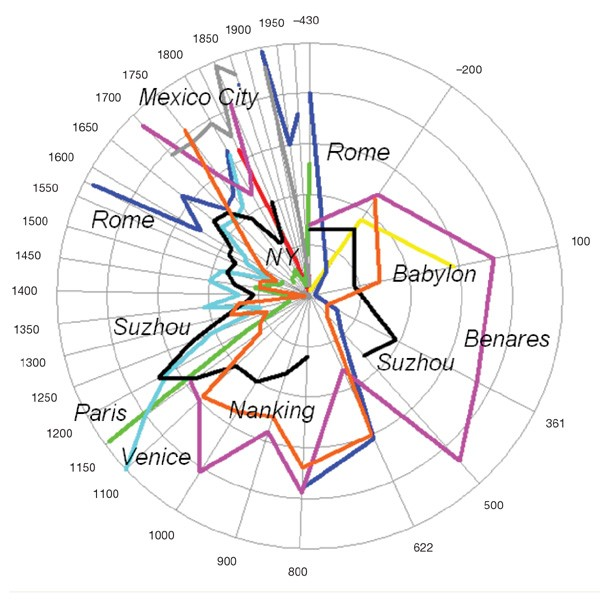
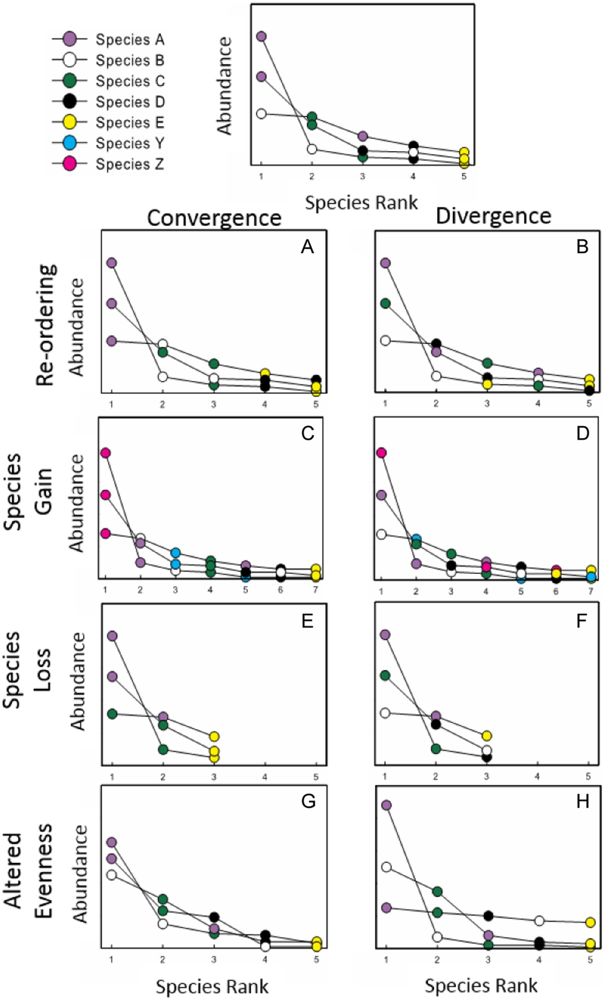
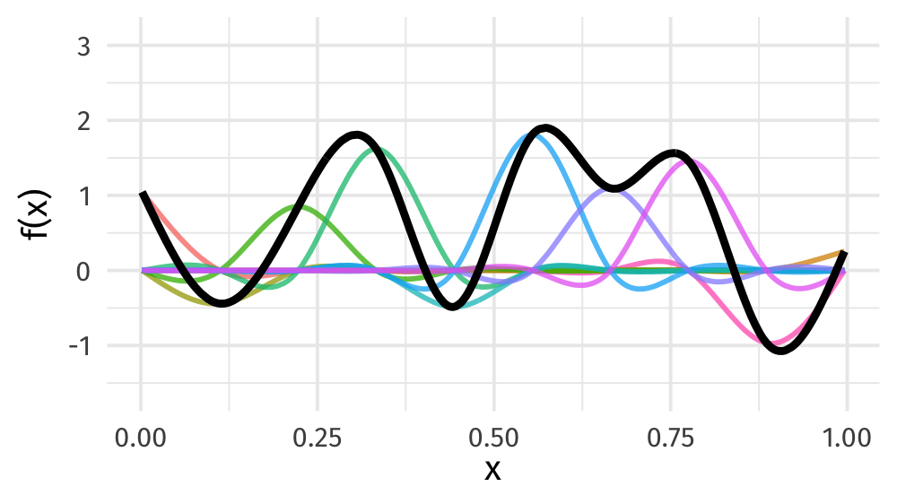
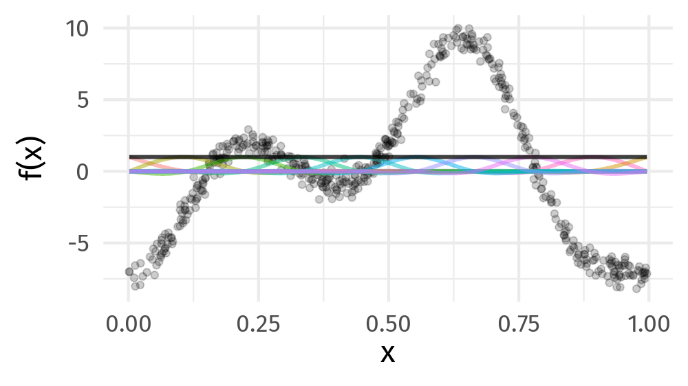

```{r xaringan-tile-view, echo=FALSE}
xaringanExtra::use_tile_view()
```

.row[

.col-8[

* [bit.ly/water-talk-2024](https://bit.ly/water-talk-2024)

]

.col-4[

.center[

```{r, fig.align = "center", out.width="90%", echo=FALSE}

```
]

]

]

???


```{r setup, include=FALSE, cache=FALSE}
options(htmltools.dir.version = FALSE)
knitr::opts_chunk$set(cache = TRUE, dev = 'svg', echo = FALSE, message = FALSE, warning = FALSE, fig.height=6, fig.width = 1.777777*6)

library("readr")
library("tibble")
library("purrr")
library("ggplot2")
library("dplyr")
library("tidyr")
library("mgcv")
library("mvnfast")
library("gratia")
library("patchwork")
library("gganimate")
theme_set(theme_minimal(base_size = 14, base_family = 'Fira Sans'))
library("here")

library("cepreader")

## constats
anim_width <- 1000
anim_height <- anim_width / 1.77777777
anim_dev <- 'png'
anim_res <- 200
```

---

# Rank abundance diagrams

```{r load-lowe2-and-process-to-rad, echo = FALSE}

# read the data - it's in CEP format so we need a special reader
lowe2 <- readCEP(here("data/loch-of-lowes/lowe2.cep")) |>
  tibble::rownames_to_column(var = "sample") |>
  as_tibble() |>
  mutate(depth = gsub("^LOWE", "", sample),
    depth = as.numeric(depth)) |>
  relocate(depth, .after = 1L)

# create data in RAD form
lowe2_rad <- lowe2 |>
  pivot_longer(!c(depth, sample),
    names_to = "species", values_to = "abundance") |>
  group_by(sample) |>
  mutate(rank = rank(-abundance, ties.method = "first"),
    f_sample = factor(sample),
    f_depth = factor(depth, levels = lowe2$depth)) |>
  ungroup()

# plot it
lowe2_rad_plt <- lowe2_rad |>
  ggplot(aes(x = rank, y = abundance, group = f_sample, colour = depth)) +
  geom_point() +
  facet_wrap(~f_depth) +
  scale_colour_viridis_c(direction = -1) +
  labs(x = "Rank", y = "Abundance") +
  theme_gray()

# plot one depth to show the RAD
lowe2_one_depth_plt <- lowe2_rad |>
  filter(f_depth == 30) |>
  ggplot(aes(x = rank, y = abundance)) +
  geom_point() +
  labs(x = "Rank", y = "Abundance") +
  theme_gray()
```

```{r lowe-rad-one-depth-plot, fig.align = "center", out.width = "90%"}
lowe2_one_depth_plt
```
---

# Rank abundance diagrams

.row[

.col-6[
RADs and SADs have been studied for about a century

Fundamental description of a community

RADs preserve almost all the data

Loose the species identity
]

.col-6[
```{r lowe-rad-one-depth-plot, fig.align = "center", out.width = "90%"}
```
]
]

---

# Modelling failure

RADs & SADs have been tortured to death with all manner or mechanistic and deterministic models

* Fisher's log-series fit to abundances
* Preston's log-normal fit (to binned abundances)
* MacArthur's broken stick model
* &hellip;

Some are statistical, some mechanistic, and all fit some data sets well and others poorly

Data don't contain enough information to distinguish between models

Arguably a failure

---

# Recent interest

Continued interest because RAD is such a fundamental descriptor

Focus has shifted to how have RADs changed over time

* Rank clocks (Batty _Nature_, 2006; Collins et al _Ecology_ 2008)

* Metrics (Avolio et al _Ecosphere_ 2015)

---

# Rank clocks

```{r batty-rank-clocks, fig.align = "center", out.width = "50%"}

```

.small[
  Batty (2006) _Nature_
]

???

Terrible data visualization, but Mike uses features of the clock to derive some scaling rules that summarise the underlying dynamics

---

# Avolio et al's Metrics

.row[

.col-8[

* Convert data to RAD

* Compute metrics

* Test change in metrics over time (space) using some model or permutation test

]

.col-4[

```{r avolio-rads, fig.align = "center", out.width = "100%"}

```

]
]
.small[
  Avolio _et al_ (2015) _Ecosphere_
]
 
???

---

# Modelling the RAD

Rank clocks don't lend themselves to identify when and how RADs have changed

Avolio et al's metrics are one or more steps removed from the RAD (propagation of uncertainty)

--

Instead, I propose that we model the RAD itself

Rather than force a particular shape or mechanism, do this phenomenologically

Let the data determine the shape of the RAD

---

# From my abstract

> I will briefly describe the proposed approach and demonstrate its use with examples from a long-term nutrient enrichment experiment, a spatial survey from a serpentine grassland, and a time series of a desert rodent community.

in 10 minutes!

---

# LOL

.center[
.massive[
🤣
]
]

---

# Loch of the Lowes

Freshwater loch in a wildlife reserve

Data are from a sediment core

Think of this as an irregularly-spaced time series

Counts of diatoms in each sediment sample

---

# Loch of the Lowes

```{r full-lowe2-rad, fig.align = "center", out.width = "80%"}
lowe2_rad_plt
```

Aim: model the RADs for each time point and how they have changed over time

---
class: inverse
background-image: url('./resources/god-father-poster.jpg')
background-size: cover

???

As part of what Ben called the GAM Mafia, of course I have to do this as a GAM

---

# Generalized additive models

\begin{align*}
y_i &\sim    \mathcal{D}(\mu_i, \boldsymbol{\phi}) \\
g(\mu_i) &=  \mathbf{A}_i\boldsymbol{\gamma} + f_1(x_{1,i}) + f_2(x_{2,i}) + f_3(x_{3,i}, x_{4,i}) + \cdots
\end{align*}

Linear predictor of strictly parametric terms plus a sum of smooth, arbitrary functions of covariates

Model is *very* general

> Everything is a GAM!

--

The smooth functions $f()$ are set up as penalized splines

---

# Splines formed from basis functions

```{r smooth-fun-animation, results = FALSE}
f <- function(x) {
    x^11 * (10 * (1 - x))^6 + ((10 * (10 * x)^3) * (1 - x)^10)
}

draw_beta <- function(n, k, mu = 1, sigma = 1) {
    rmvn(n = n, mu = rep(mu, k), sigma = diag(rep(sigma, k)))
}

weight_basis <- function(bf, x, n = 1, k, ...) {
    beta <- draw_beta(n = n, k = k, ...)
    out <- sweep(bf, 2L, beta, '*')
    colnames(out) <- paste0('f', seq_along(beta))
    out <- as_tibble(out)
    out <- add_column(out, x = x)
    out <- pivot_longer(out, -x, names_to = 'bf', values_to = 'y')
    out
}

random_bases <- function(bf, x, draws = 10, k, ...) {
    out <- rerun(draws, weight_basis(bf, x = x, k = k, ...))
    out <- bind_rows(out)
    out <- add_column(out, draw = rep(seq_len(draws), each = length(x) * k),
                      .before = 1L)
    class(out) <- c("random_bases", class(out))
    out
}

plot.random_bases <- function(x, facet = FALSE) {
    plt <- ggplot(x, aes(x = x, y = y, colour = bf)) +
        geom_line(lwd = 1, alpha = 0.75) +
        guides(colour = FALSE)
    if (facet) {
        plt + facet_wrap(~ draw)
    }
    plt
}

normalize <- function(x) {
    rx <- range(x)
    z <- (x - rx[1]) / (rx[2] - rx[1])
    z
}

set.seed(1)
N <- 500
data <- tibble(x     = runif(N),
               ytrue = f(x),
               ycent = ytrue - mean(ytrue),
               yobs  = ycent + rnorm(N, sd = 0.5))

k <- 10
knots <- with(data, list(x = seq(min(x), max(x), length = k)))
sm <- smoothCon(s(x, k = k, bs = "cr"), data = data, knots = knots)[[1]]$X
colnames(sm) <- levs <- paste0("f", seq_len(k))
basis <- pivot_longer(cbind(sm, data), -(x:yobs), names_to = 'bf')
## basis

set.seed(2)
bfuns <- random_bases(sm, data$x, draws = 20, k = k)

smooth <- bfuns %>%
    group_by(draw, x) %>%
    summarise(spline = sum(y)) %>%
    ungroup()

p1 <- ggplot(smooth) +
    geom_line(data = smooth, aes(x = x, y = spline), lwd = 1.5) +
    labs(y = 'f(x)', x = 'x') +
    theme_minimal(base_size = 16, base_family = 'Fira Sans')

smooth_funs <- animate(
    p1 + transition_states(draw, transition_length = 4, state_length = 2) +
    ease_aes('cubic-in-out'),
    nframes = 200, height = anim_height, width = anim_width, res = anim_res, dev = anim_dev, units = "px")

anim_save('resources/spline-anim.gif', smooth_funs)
```
```{r basis-functions, fig.height=6, fig.width = 1.777777*6, fig.align = "center"}
ggplot(basis,
       aes(x = x, y = value, colour = bf)) +
    geom_line(lwd = 2, alpha = 0.5) +
    guides(colour = FALSE) +
    labs(x = 'x', y = 'b(x)') +
    theme_minimal(base_size = 20, base_family = 'Fira Sans')
```

???

Splines are built up from basis functions

Here I'm showing a cubic regression spline basis with 10 knots/functions

We weight each basis function to get a spline. Here all the basis functions have the same weight so they would fit a horizontal line

---

# Weight basis functions &#8680; spline

```{r basis-function-animation, results = 'hide'}
bfun_plt <- plot(bfuns) +
    geom_line(data = smooth, aes(x = x, y = spline),
              inherit.aes = FALSE, lwd = 1.5) +
    labs(x = 'x', y = 'f(x)') +
    theme_minimal(base_size = 14, base_family = 'Fira Sans')

bfun_anim <- animate(
    bfun_plt + transition_states(draw, transition_length = 4, state_length = 2) +
        ease_aes("cubic-in-out"),
    nframes = 200, height = anim_height, width = anim_width, res = anim_res,
    dev = anim_dev, units = "px")

anim_save('resources/basis-fun-anim.gif', bfun_anim)
```

.center[]

???

But if we choose different weights we get more wiggly spline

Each of the splines I showed you earlier are all generated from the same basis functions just using different weights

---

# Maximise penalised log-likelihood &#8680; &beta;

```{r basis-functions-anim, results = "hide", eval = FALSE}
sm2 <- smoothCon(s(x, k = k, bs = "cr"), data = data, knots = knots)[[1]]$X
beta <- coef(lm(ycent ~ sm2 - 1, data = data))
wtbasis <- sweep(sm2, 2L, beta, FUN = "*")
colnames(wtbasis) <- colnames(sm2) <- paste0("F", seq_len(k))
## create stacked unweighted and weighted basis
basis <- as_tibble(rbind(sm2, wtbasis)) %>%
    add_column(x = rep(data$x, times = 2),
               type = rep(c('unweighted', 'weighted'), each = nrow(sm2)),
               .before = 1L)
##data <- cbind(data, fitted = rowSums(scbasis))
wtbasis <- as_tibble(rbind(sm2, wtbasis)) %>%
    add_column(x      = rep(data$x, times = 2),
               fitted = rowSums(.),
               type   = rep(c('unweighted', 'weighted'), each = nrow(sm2))) %>%
    pivot_longer(-(x:type), names_to = 'bf')
basis <- pivot_longer(basis, -(x:type), names_to = 'bf')

p3 <- ggplot(data, aes(x = x, y = ycent)) +
    geom_point(aes(y = yobs), alpha = 0.2) +
    geom_line(data = basis,
              mapping = aes(x = x, y = value, colour = bf),
              lwd = 1, alpha = 0.5) +
    geom_line(data = wtbasis,
              mapping = aes(x = x, y = fitted), lwd = 1, colour = 'black', alpha = 0.75) +
    guides(colour = FALSE) +
    labs(y = 'f(x)', x = 'x') +
    theme_minimal(base_size = 16, base_family = 'Fira Sans')

crs_fit <- animate(p3 + transition_states(type, transition_length = 4, state_length = 2) + 
                   ease_aes('cubic-in-out'),
                   nframes = 100, height = anim_height, width = anim_width, res = anim_res,
                   dev = anim_dev, units = "px")

anim_save('./resources/gam-crs-animation.gif', crs_fit)
```

.center[]

???

Fitting a GAM involves finding the weights for the basis functions that produce a spline that fits the data best, subject to some constraints

---
class: inverse
<!-- background-image: url('./resources/christopher-burns-8KfCR12oeUM-unsplash.jpg') -->
background-image: url('./resources/mathieu-stern-tv7GF92ZWvs-unsplash.jpg')
background-size: contain

# Work very much in-progress

---

# Models

Treat the RAD as a histogram and smooth it &mdash; rich history

How to model the change in RADs over samples?

1. Treat each RAD as a subject & smooth them pooling over subjects
    * `s(rank) + s(rank, depth, bs = "fs")`
2. Treat each RAD as a subject & smooth them shrinking temporal neighbours
    * `s(rank) + s(rank, bs = "mrf", xt = list(depth_pen))`
3. Use a tensor product and assume RAD smooth varies smoothly over time
    * `s(rank) + te(rank, depth)`

```{r fit-rad-gams, echo = FALSE, results = "hide", warning = FALSE}

ctrl <- gam.control(trace = FALSE)

lowe2_m1 <- bam(abundance ~
  s(rank, bs = "cr", k = 6) +
  s(rank, f_depth, bs = "fs", k = 6),
data = lowe2_rad,
family = nb(),
method = "fREML",
discrete = TRUE,
control = ctrl,
nthreads = 3
)

lowe2_m2 <- bam(abundance ~
    s(rank, bs = "cr", k = 6) +
    s(depth, bs = "cr", k = 10) +
    ti(rank, depth, bs = c("cr", "cr"), k = c(10, 10)),
  data = lowe2_rad,
  family = nb(),
  method = "fREML",
  discrete = TRUE,
  control = ctrl,
  nthreads = 3
)

lowe2_m3 <- bam(abundance ~
    s(rank, bs = "ad", k = 10) +
    s(depth, bs = "cr", k = 10) +
    ti(rank, depth, bs = c("cr", "cr"), k = c(10, 10)),
  data = lowe2_rad,
  family = nb(),
  method = "fREML",
  discrete = TRUE,
  control = ctrl,
  nthreads = 3
)

# data slices for the two forms of model covariates
lowe_ds_m1 <- data_slice(
  lowe2_m1,
  rank = evenly(rank),
  f_depth = evenly(f_depth)
)

lowe_ds_m2 <- data_slice(
  lowe2_m2,
  rank = evenly(rank),
  depth = unique(depth)
)

# fitted values
fv_lowe_m1 <- fitted_values(lowe2_m1, data = lowe_ds_m1)
fv_lowe_m2 <- fitted_values(lowe2_m2, data = lowe_ds_m2)
fv_lowe_m3 <- fitted_values(lowe2_m3, data = lowe_ds_m2)

# AIC favours the adaptive spline version m3 and it seems to do better at
# capturing the abundace of the rank 1 or 2 taxa better in all years.
```

---

# Best fitting model

```{r lowe-rad-best-model-so-far, eval = FALSE, echo = TRUE}
lowe2_m3 <- bam(abundance ~
    s(rank, bs = "ad", k = 10) + # adaptive wiggliness smooth
    s(depth, bs = "cr", k = 10) + # main time effect
    ti(rank, depth, bs = c("cr", "cr"), k = c(10, 10)), # smooth interaction
  data = lowe2_rad,
  family = nb(),
  method = "fREML",
  discrete = TRUE,
  nthreads = 3
)
```

EDF ~ 30

---

# Use the model

```{r lowe-rad-fitted-plot, echo = FALSE, fig.align = "center", out.width = "100%"}
lowe2_rad |>
  ggplot(aes(x = rank, y = abundance, group = depth)) +
  geom_point(alpha = 0.5, size = 1) +
  facet_wrap(~ depth) +
  geom_line(data = fv_lowe_m3,
    aes(y = .fitted, x = rank, group = depth),
    colour = "red") +
  labs(x = "Species rank", y = "Abundance") +
  theme_gray()
```

---

# Use the model

```{r lowe-rad-ts-plot, echo = FALSE, fig.align = "center", out.width = "100%"}
lowe_ds_rank_ts <- data_slice(
  lowe2_m3,
  rank = evenly(rank, by = 1),
  depth = evenly(depth)
)

fv_lowe_rank_ts <- fitted_values(lowe2_m3, data = lowe_ds_rank_ts)

brks <- seq(2, 10, by = 2)
fv_lowe_rank_ts |>
  filter(rank <= 10) |> # the top 10 species
  ggplot(aes(x = depth, y = .fitted, group = rank)) +
  geom_ribbon(
    aes(
      ymin = .lower_ci,
      ymax = .upper_ci,
      y = .fitted,
      x = depth,
      fill = rank),
    alpha = 0.2) +
  geom_line(
    aes(
      colour = rank
    ),
    linewidth = 1
  ) +
  scale_x_reverse() +
  scale_fill_viridis_c(
    breaks = brks,
    option = "inferno",
    direction = -1
  ) +
  scale_colour_viridis_c(
    breaks = brks,
    option = "inferno",
    direction = -1
  ) +
  labs(y = "Abundance", x = "Sample depth", fill = "Rank", colour = "Rank") +
  theme_gray()

```

---

# Problems

* RADs are monotonic, strictly non-increasing &mdash; the smooths aren't
    * Data help, but using GAM machinery could violate this
* Can fit shape-constrained splines which force montonicity
    * *scam* 📦 smooths can't be combined in tensor products
    * Can't mix constrained smooth for the RAD with unconstrained smooth for change in RAD over time, space
    * Super slow, even for modest data sets
    * P spline world might have some options (Marx & Eilers)
* Could also switch to modelling the SAD but convert model fits into RAD format (e.g. Alroy, 2024 _EcoEvoRxiv_)

---

# Future work

* Respect the monotonicity constraint on the RAD

* Use the model to derive some of the things ecologists care about (sense Avolio _et al_)

    * Derivative of estimated RAD could be used for change in eveness

* &hellip; more

---

# Thank you & More 📷

Mail: gavin@anivet.au.dk

[github.com/gavinsimpson/ecos-water-talk-may-2024](https://github.com/gavinsimpson/ecos-water-talk-may-2024)

.center[

```{r, fig.align = "center", out.width="45%"}

```
]
